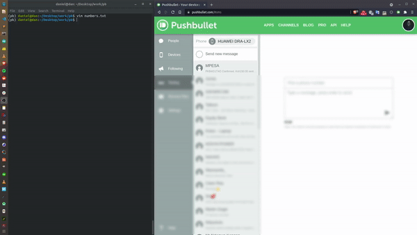

# Pushbullet api python
## Task : Send SMS messages to a list of numbers in a file
## Install dependencies

```bash
pip install -r requirements.txt
```

## Usage
In order to use the API you need an API key that can be obtained .[here](https://www.pushbullet.com/account). This is user specific and is used instead of passwords.
Create a .env file and add your api key obtained above as:
```python
API_KEY = "your api key"
```
## Demo
Run the script and voilà

</img>
